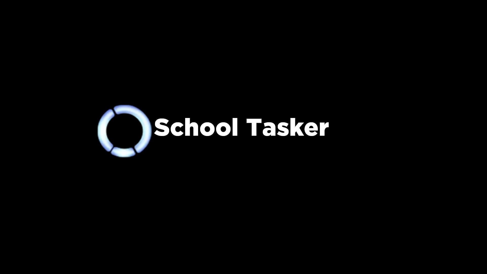

# School Tasker

    

## About
School Tasker is a homework planner bot made on the Russian Telegram platform. The features of the bot are as follows:
* Recognizing users as regular and administrators in order to correctly assign appropriate powers to everyone;
* Automatic filtering of tasks by time to make reading tasks easier;
* Automatic check of tasks for “suitability” - when the deadline expires, the task is automatically deleted by algorithms in real time;
* Advanced and convenient task editor for users,
* Automatic mailing from the bot after adding a task
* and a lot of more!

The development of School Tasker focuses on three principles: convenience, accessibility and speed - these are the characteristics that describe the work of School Tasker as a tool for mass use in the field of task schedulers for large audiences

## Why School Tasker?

School Tasker is convenient and accessible for mass use for all user roles: not only as an electronic diary for ordinary users, but also as an electronic diary for administrators (prefects and teachers)

In addition, thanks to mass mailing from the bot (which can be customized by each user), students will know exactly when, what and on what date the assignment is given

Over time, if this bot is in demand, School Tasker will be further developed and supplemented with new functionality

## Authors

School Tasker is under development by Vladislav Skidan (https://github.com/TheDanskiSon09)

School Tasker is using Hammett framework, written by cusdeb.com (https://github.com/cusdeb-com)

## Licensing

The code of School Tasker is licensed under the MIT License (https://en.wikipedia.org/wiki/MIT_License)

You can see a full license here (https://github.com/TheDanskiSon09/School-Tasker/blob/main/LICENSE.md) 

## Contact

Meet the School Tasker bot : https://t.me/SchoolTaskerbot

If you have any ideas and wishes or you encounter with problems when working with the bot, you can always contact the developer to make School Tasker better : https://t.me/TheDanskiSon09

